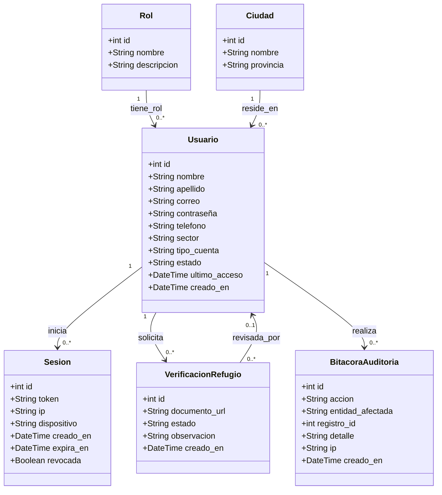
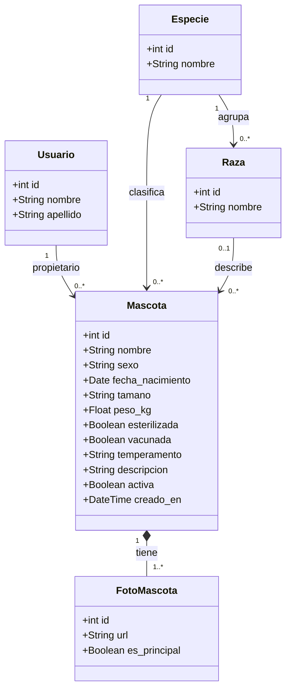
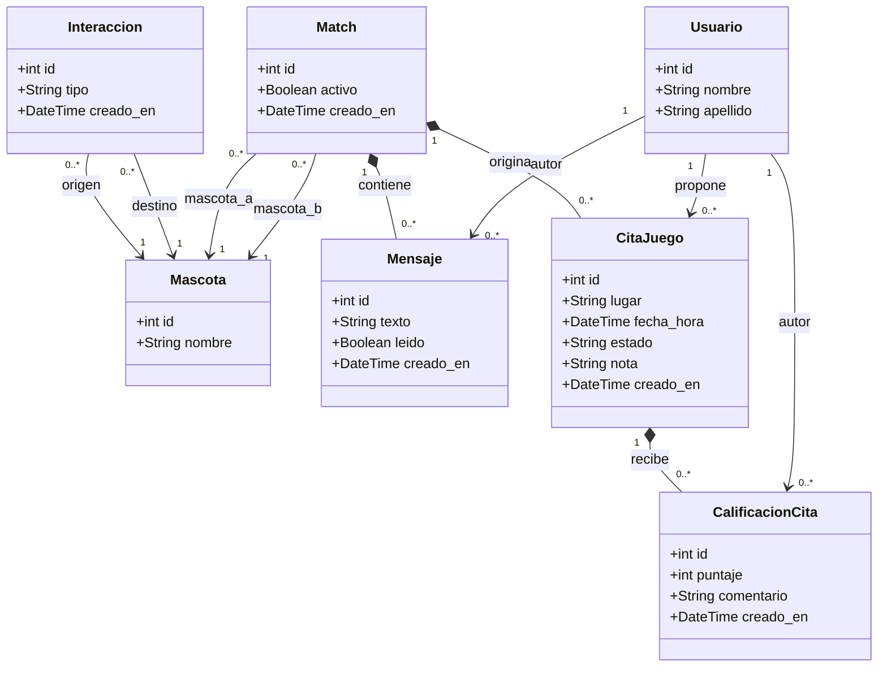
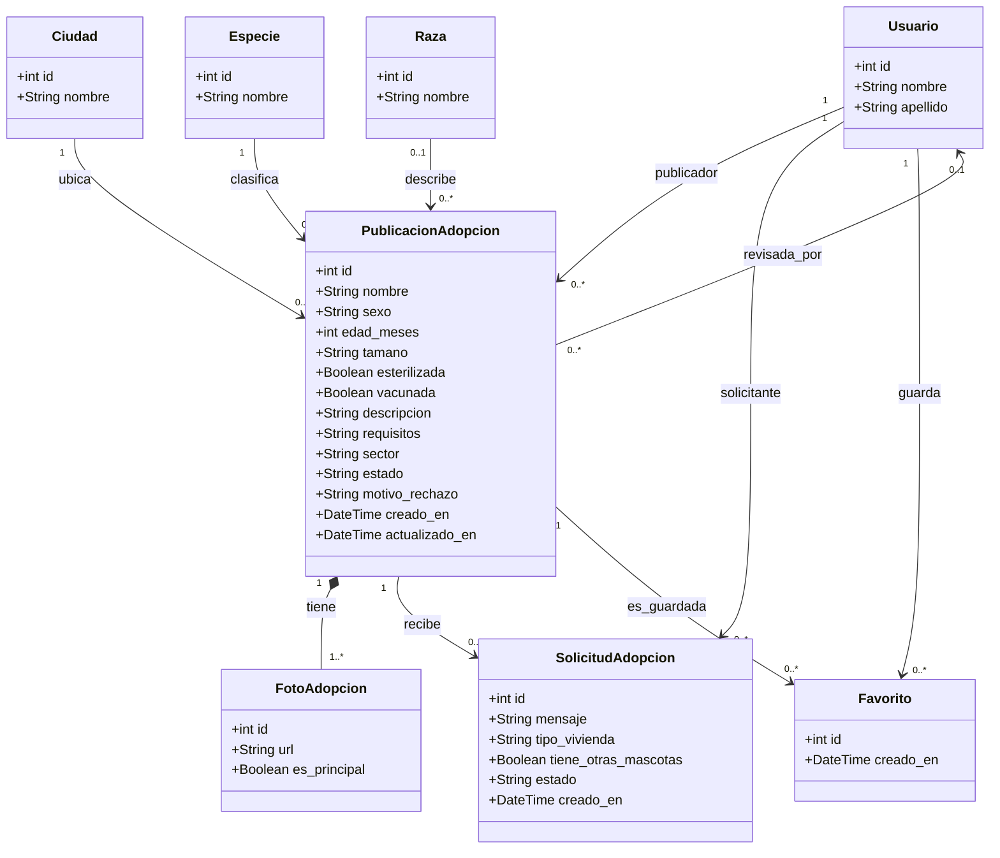
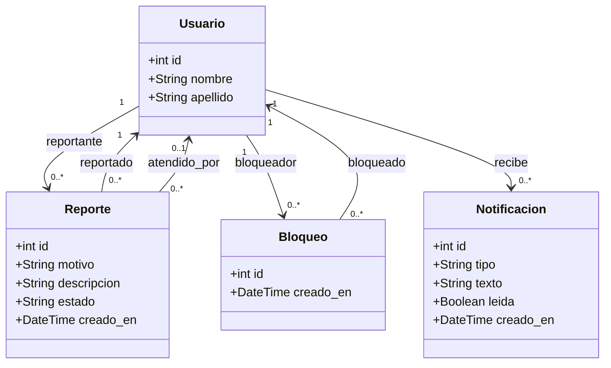
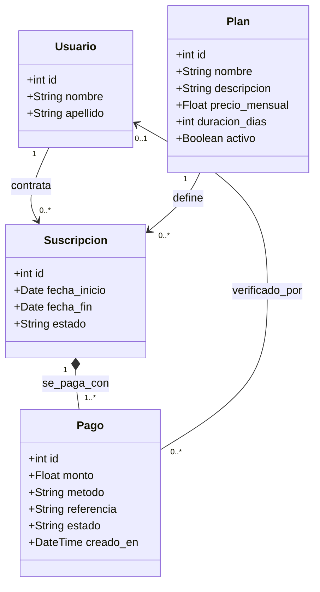
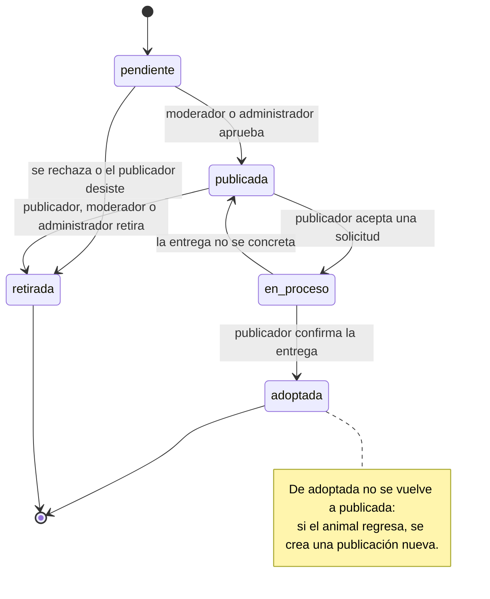

# Hito 1 · Ficha del negocio

**Pareja:** [Jaime Joustin Quijije Suárez] · [Bryan Josue Chiquito Delgado]
**Paralelo:** [4to "B"]
**Negocio en una línea:** Aplicación web donde los dueños de mascotas hacen match para organizar citas de juego entre sus mascotas, y además donde personas y refugios publican mascotas en adopción para que otros las adopten.

## 1. Negocio de referencia

BabelBark es una plataforma de software que reúne en una sola app y portal a todos los que rodean la vida de una mascota (perros y gatos): el dueño, el veterinario, el peluquero, el paseador, el entrenador y los refugios. Los veterinarios y proveedores usan un portal en la nube para gestionar clientes, agendar citas y monitorear a distancia; los dueños usan la app para conectarse con ellos y recibir contenido según su mascota. Funciona con modelo freemium: según el fundador, Roy Stein, medían el avance por uso y no por ingresos, y los planes premium por suscripción aún no se habían lanzado por completo. Las cifras que declara (2019): 425.000 USD de ingresos al mes en la ficha de Starter Story, 2 fundadores, 17 empleados, más de 200.000 mascotas en la plataforma, más de 7.800 descargas solo en julio de 2019 y un costo por conversión que bajó de 7 o 8 USD a poco más de 2 USD. Crecieron con publicidad digital y con alianzas con veterinarias y refugios.

**Enlace:** https://www.starterstory.com/stories/how-a-simple-idea-turned-into-a-pet-platform-with-thousands-of-users

## 2. Caso de contraste

United Dogs (registrada como United Pets en Dealroom) fue una red social para dueños de perros y gatos fundada en 2007 en Tallinn, Estonia: cada dueño creaba el perfil de su mascota y compartía fotos, videos y blogs. Según Dealroom recibió 170.000 € de inversión ángel en 2008 y 480.000 € en una ronda serie A en 2009, tenía entre 2 y 10 empleados, su fuente de ingresos figura como publicidad y hoy está cerrada. Hipótesis nuestra, porque la fuente no explica el cierre: una red social gratuita que vive de publicidad solo gana dinero con una audiencia masiva y constante, y ni el usuario ni ningún negocio pagaba por el servicio, así que sostener y hacer crecer la plataforma dependía del capital invertido y no de ingresos propios. BabelBark, en cambio, se apoya en veterinarios, refugios y otros negocios que usan la plataforma. Nuestra app evita esa diferencia de fondo: cobra un plan premium con pagos verificados y no depende de la publicidad.

**Fuente:** https://app.dealroom.co/companies/united_pets

## 3. Adaptación al Ecuador

1. **Cobros en línea limitados.** Varias pasarelas internacionales no operan con comercios ecuatorianos y muchos usuarios no tienen tarjeta para pagos en línea. Efecto: una suscripción premium por tarjeta internacional excluiría a gran parte del público, así que el cobro debe hacerse por transferencia o con una pasarela local.
2. **Conexión desigual fuera de las ciudades grandes.** En zonas con datos móviles caros o inestables, una app con muchas fotos pesadas carga lento o no carga. Efecto: las fotos se comprimen al subirlas y los listados se cargan por páginas cortas.
3. **Adopción manejada de manera informal.** Las fundaciones y rescatistas independientes suelen publicar animales por WhatsApp o redes sociales, sin registro ni seguimiento, y no hay forma de saber si el animal ya fue adoptado. Efecto: cada publicación pasa por revisión de un moderador y tiene un estado visible, y los refugios deben verificarse antes de publicar, para evitar publicaciones falsas o duplicadas.
4. **Datos personales y ubicación.** La Ley Orgánica de Protección de Datos Personales exige consentimiento para tratar datos como la ubicación. Efecto: la app guarda solo ciudad y sector, no la ubicación exacta, y pide aceptar el uso de datos al registrarse.

**Qué cambió en el modelo por estas restricciones:** El ingreso ya no depende de una suscripción con tarjeta: el plan premium se paga por transferencia o pasarela local y cada pago lo verifica un moderador o administrador (entidades `Plan`, `Suscripcion` y `Pago`). La adopción es gratuita y pasa por moderación previa (estado «pendiente»), y los refugios se validan con la entidad `VerificacionRefugio`. La ubicación se guarda como ciudad (entidad `Ciudad`) y sector, y las fotos se almacenan comprimidas.

## 4. Modelo de datos

### Entidad: Rol

| Atributo | Tipo | Obligatorio | Ejemplo |
|----------|------|-------------|---------|
| id | número entero | sí | 1 |
| nombre | uno de: usuario, moderador, administrador | sí | moderador |
| descripcion | texto | no | Revisa publicaciones y reportes |

### Entidad: Ciudad

| Atributo | Tipo | Obligatorio | Ejemplo |
|----------|------|-------------|---------|
| id | número entero | sí | 1 |
| nombre | texto | sí | Manta |
| provincia | texto | sí | Manabí |

### Entidad: Usuario

| Atributo | Tipo | Obligatorio | Ejemplo |
|----------|------|-------------|---------|
| id | número entero | sí | 45 |
| rol | referencia a otra entidad (Rol) | sí | usuario |
| ciudad | referencia a otra entidad (Ciudad) | sí | Manta |
| nombre | texto | sí | María |
| apellido | texto | sí | Cedeño |
| correo | texto | sí | maria@correo.com |
| contraseña | texto | sí | $2b$12$K9x… |
| telefono | texto | no | 0991234567 |
| sector | texto | no | Barrio Umiña |
| tipo_cuenta | uno de: persona, refugio | sí | persona |
| estado | uno de: activa, suspendida, eliminada | sí | activa |
| ultimo_acceso | fecha y hora | no | 2026-10-02 14:30 |
| creado_en | fecha y hora | sí | 2026-09-20 10:00 |

### Entidad: Sesion

| Atributo | Tipo | Obligatorio | Ejemplo |
|----------|------|-------------|---------|
| id | número entero | sí | 900 |
| usuario | referencia a otra entidad (Usuario) | sí | María Cedeño |
| token | texto | sí | a3f9…c21 |
| ip | texto | no | 190.15.20.4 |
| dispositivo | texto | no | Chrome en Android |
| creado_en | fecha y hora | sí | 2026-10-02 14:30 |
| expira_en | fecha y hora | sí | 2026-10-09 14:30 |
| revocada | sí/no | sí | no |

### Entidad: VerificacionRefugio

| Atributo | Tipo | Obligatorio | Ejemplo |
|----------|------|-------------|---------|
| id | número entero | sí | 5 |
| usuario | referencia a otra entidad (Usuario) | sí | Fundación Huellas |
| documento_url | texto | sí | docs/ruc_huellas.pdf |
| estado | uno de: pendiente, aprobada, rechazada | sí | pendiente |
| revisada_por | referencia a otra entidad (Usuario) | no | Moderador Pérez |
| observacion | texto | no | Documento legible y vigente |
| creado_en | fecha y hora | sí | 2026-10-01 09:00 |

### Entidad: BitacoraAuditoria

| Atributo | Tipo | Obligatorio | Ejemplo |
|----------|------|-------------|---------|
| id | número entero | sí | 2100 |
| usuario | referencia a otra entidad (Usuario) | sí | Administrador Mora |
| accion | texto | sí | suspender_usuario |
| entidad_afectada | texto | sí | Usuario |
| registro_id | número entero | sí | 88 |
| detalle | texto | no | Perfil falso confirmado |
| ip | texto | no | 190.15.20.9 |
| creado_en | fecha y hora | sí | 2026-10-05 12:10 |

### Entidad: Especie

| Atributo | Tipo | Obligatorio | Ejemplo |
|----------|------|-------------|---------|
| id | número entero | sí | 1 |
| nombre | texto | sí | perro |

### Entidad: Raza

| Atributo | Tipo | Obligatorio | Ejemplo |
|----------|------|-------------|---------|
| id | número entero | sí | 7 |
| especie | referencia a otra entidad (Especie) | sí | perro |
| nombre | texto | sí | Labrador |

### Entidad: Mascota

| Atributo | Tipo | Obligatorio | Ejemplo |
|----------|------|-------------|---------|
| id | número entero | sí | 10 |
| propietario | referencia a otra entidad (Usuario) | sí | María Cedeño |
| especie | referencia a otra entidad (Especie) | sí | perro |
| raza | referencia a otra entidad (Raza) | no | Mestizo |
| nombre | texto | sí | Luna |
| sexo | uno de: macho, hembra | sí | hembra |
| fecha_nacimiento | fecha | sí | 2023-05-14 |
| tamano | uno de: pequeño, mediano, grande | sí | mediano |
| peso_kg | número decimal | no | 12.5 |
| esterilizada | sí/no | sí | sí |
| vacunada | sí/no | sí | sí |
| temperamento | texto | no | Juguetona y sociable |
| descripcion | texto | no | Le gusta correr en el parque |
| activa | sí/no | sí | sí |
| creado_en | fecha y hora | sí | 2026-09-20 10:15 |

### Entidad: FotoMascota

| Atributo | Tipo | Obligatorio | Ejemplo |
|----------|------|-------------|---------|
| id | número entero | sí | 25 |
| mascota | referencia a otra entidad (Mascota) | sí | Luna |
| url | texto | sí | fotos/luna1.jpg |
| es_principal | sí/no | sí | sí |

### Entidad: Interaccion

| Atributo | Tipo | Obligatorio | Ejemplo |
|----------|------|-------------|---------|
| id | número entero | sí | 300 |
| mascota_origen | referencia a otra entidad (Mascota) | sí | Luna |
| mascota_destino | referencia a otra entidad (Mascota) | sí | Rocky |
| tipo | uno de: like, descartar | sí | like |
| creado_en | fecha y hora | sí | 2026-10-02 15:10 |

### Entidad: Match

| Atributo | Tipo | Obligatorio | Ejemplo |
|----------|------|-------------|---------|
| id | número entero | sí | 50 |
| mascota_a | referencia a otra entidad (Mascota) | sí | Luna |
| mascota_b | referencia a otra entidad (Mascota) | sí | Rocky |
| activo | sí/no | sí | sí |
| creado_en | fecha y hora | sí | 2026-10-02 15:12 |

### Entidad: Mensaje

| Atributo | Tipo | Obligatorio | Ejemplo |
|----------|------|-------------|---------|
| id | número entero | sí | 800 |
| match | referencia a otra entidad (Match) | sí | Luna y Rocky |
| autor | referencia a otra entidad (Usuario) | sí | María Cedeño |
| texto | texto | sí | ¿Nos vemos el sábado en el parque? |
| leido | sí/no | sí | no |
| creado_en | fecha y hora | sí | 2026-10-02 15:20 |

### Entidad: CitaJuego

| Atributo | Tipo | Obligatorio | Ejemplo |
|----------|------|-------------|---------|
| id | número entero | sí | 12 |
| match | referencia a otra entidad (Match) | sí | Luna y Rocky |
| propuesta_por | referencia a otra entidad (Usuario) | sí | María Cedeño |
| lugar | texto | sí | Parque Central |
| fecha_hora | fecha y hora | sí | 2026-10-10 16:00 |
| estado | uno de: propuesta, confirmada, realizada, cancelada | sí | propuesta |
| nota | texto | no | Llevar agua y correa |
| creado_en | fecha y hora | sí | 2026-10-02 15:30 |

### Entidad: CalificacionCita

| Atributo | Tipo | Obligatorio | Ejemplo |
|----------|------|-------------|---------|
| id | número entero | sí | 3 |
| cita | referencia a otra entidad (CitaJuego) | sí | Cita del 10 de octubre |
| autor | referencia a otra entidad (Usuario) | sí | María Cedeño |
| puntaje | número entero | sí | 5 |
| comentario | texto | no | Muy puntuales y amables |
| creado_en | fecha y hora | sí | 2026-10-10 18:30 |

### Entidad: Bloqueo

| Atributo | Tipo | Obligatorio | Ejemplo |
|----------|------|-------------|---------|
| id | número entero | sí | 2 |
| bloqueador | referencia a otra entidad (Usuario) | sí | María Cedeño |
| bloqueado | referencia a otra entidad (Usuario) | sí | Usuario 88 |
| creado_en | fecha y hora | sí | 2026-10-05 11:00 |

### Entidad: PublicacionAdopcion

| Atributo | Tipo | Obligatorio | Ejemplo |
|----------|------|-------------|---------|
| id | número entero | sí | 70 |
| publicador | referencia a otra entidad (Usuario) | sí | Fundación Huellas |
| revisada_por | referencia a otra entidad (Usuario) | no | Moderador Pérez |
| especie | referencia a otra entidad (Especie) | sí | gato |
| raza | referencia a otra entidad (Raza) | no | Mestiza |
| ciudad | referencia a otra entidad (Ciudad) | sí | Manta |
| nombre | texto | sí | Canela |
| sexo | uno de: macho, hembra | sí | hembra |
| edad_meses | número entero | sí | 12 |
| tamano | uno de: pequeño, mediano, grande | sí | pequeño |
| esterilizada | sí/no | sí | sí |
| vacunada | sí/no | sí | sí |
| descripcion | texto | sí | Rescatada, cariñosa, convive bien con niños |
| requisitos | texto | no | Visita previa y contrato de adopción |
| sector | texto | no | Barrio Tarqui |
| estado | uno de: pendiente, publicada, en_proceso, adoptada, retirada | sí | pendiente |
| motivo_rechazo | texto | no | Foto no corresponde al animal |
| creado_en | fecha y hora | sí | 2026-10-03 09:00 |
| actualizado_en | fecha y hora | sí | 2026-10-03 09:00 |

### Entidad: FotoAdopcion

| Atributo | Tipo | Obligatorio | Ejemplo |
|----------|------|-------------|---------|
| id | número entero | sí | 120 |
| publicacion | referencia a otra entidad (PublicacionAdopcion) | sí | Canela |
| url | texto | sí | fotos/canela1.jpg |
| es_principal | sí/no | sí | sí |

### Entidad: SolicitudAdopcion

| Atributo | Tipo | Obligatorio | Ejemplo |
|----------|------|-------------|---------|
| id | número entero | sí | 33 |
| publicacion | referencia a otra entidad (PublicacionAdopcion) | sí | Canela |
| solicitante | referencia a otra entidad (Usuario) | sí | Carlos Mero |
| mensaje | texto | sí | Tengo experiencia con gatos |
| tipo_vivienda | uno de: casa con patio, casa sin patio, departamento | sí | casa con patio |
| tiene_otras_mascotas | sí/no | sí | no |
| estado | uno de: pendiente, aceptada, rechazada, cancelada | sí | pendiente |
| creado_en | fecha y hora | sí | 2026-10-04 18:00 |

### Entidad: Favorito

| Atributo | Tipo | Obligatorio | Ejemplo |
|----------|------|-------------|---------|
| id | número entero | sí | 90 |
| usuario | referencia a otra entidad (Usuario) | sí | Carlos Mero |
| publicacion | referencia a otra entidad (PublicacionAdopcion) | sí | Canela |
| creado_en | fecha y hora | sí | 2026-10-04 17:40 |

### Entidad: Reporte

| Atributo | Tipo | Obligatorio | Ejemplo |
|----------|------|-------------|---------|
| id | número entero | sí | 8 |
| reportante | referencia a otra entidad (Usuario) | sí | María Cedeño |
| reportado | referencia a otra entidad (Usuario) | sí | Usuario 88 |
| motivo | uno de: contenido_inapropiado, perfil_falso, maltrato_animal, otro | sí | perfil_falso |
| descripcion | texto | no | Las fotos son de otra mascota |
| estado | uno de: abierto, resuelto, descartado | sí | abierto |
| atendido_por | referencia a otra entidad (Usuario) | no | Moderador Pérez |
| creado_en | fecha y hora | sí | 2026-10-05 11:00 |

### Entidad: Notificacion

| Atributo | Tipo | Obligatorio | Ejemplo |
|----------|------|-------------|---------|
| id | número entero | sí | 1500 |
| usuario | referencia a otra entidad (Usuario) | sí | María Cedeño |
| tipo | uno de: nuevo_match, mensaje, cita, solicitud_adopcion, estado_publicacion | sí | nuevo_match |
| texto | texto | sí | ¡Luna y Rocky hicieron match! |
| leida | sí/no | sí | no |
| creado_en | fecha y hora | sí | 2026-10-02 15:12 |

### Entidad: Plan

| Atributo | Tipo | Obligatorio | Ejemplo |
|----------|------|-------------|---------|
| id | número entero | sí | 1 |
| nombre | texto | sí | Premium mensual |
| descripcion | texto | no | Likes ilimitados y perfil destacado |
| precio_mensual | número decimal | sí | 4.99 |
| duracion_dias | número entero | sí | 30 |
| activo | sí/no | sí | sí |

### Entidad: Suscripcion

| Atributo | Tipo | Obligatorio | Ejemplo |
|----------|------|-------------|---------|
| id | número entero | sí | 21 |
| usuario | referencia a otra entidad (Usuario) | sí | María Cedeño |
| plan | referencia a otra entidad (Plan) | sí | Premium mensual |
| fecha_inicio | fecha | sí | 2026-10-06 |
| fecha_fin | fecha | sí | 2026-11-05 |
| estado | uno de: pendiente, activa, vencida, cancelada | sí | activa |

### Entidad: Pago

| Atributo | Tipo | Obligatorio | Ejemplo |
|----------|------|-------------|---------|
| id | número entero | sí | 44 |
| suscripcion | referencia a otra entidad (Suscripcion) | sí | Premium de María |
| verificado_por | referencia a otra entidad (Usuario) | no | Moderador Pérez |
| monto | número decimal | sí | 4.99 |
| metodo | uno de: transferencia, pasarela_local | sí | transferencia |
| referencia | texto | sí | Comprobante 00123456 |
| estado | uno de: pendiente, verificado, rechazado | sí | verificado |
| creado_en | fecha y hora | sí | 2026-10-06 10:15 |

### Relaciones

| Entidades | Cardinalidad | Frase |
|-----------|--------------|-------|
| Rol – Usuario | 1 a 0..* | Un rol lo tienen cero o muchos usuarios; cada usuario tiene un solo rol |
| Ciudad – Usuario | 1 a 0..* | Una ciudad agrupa cero o muchos usuarios |
| Usuario – Sesion | 1 a 0..* | Un usuario inicia cero o varias sesiones |
| Usuario – VerificacionRefugio (solicitante) | 1 a 0..* | Una cuenta de refugio envía cero o varias solicitudes de verificación |
| Usuario – VerificacionRefugio (revisión) | 0..1 a 0..* | Un moderador o administrador revisa cero o varias verificaciones |
| Usuario – BitacoraAuditoria | 1 a 0..* | Un usuario con rol de gestión deja cero o varios registros de sus acciones |
| Especie – Raza | 1 a 0..* | Una especie tiene cero o varias razas |
| Especie – Mascota | 1 a 0..* | Una especie clasifica cero o muchas mascotas |
| Raza – Mascota | 0..1 a 0..* | Una raza describe cero o muchas mascotas; la raza de una mascota es opcional |
| Usuario – Mascota | 1 a 0..* | Un usuario registra cero o varias mascotas; cada mascota tiene un solo propietario |
| Mascota – FotoMascota | 1 a 1..* | Una mascota tiene al menos una foto; cada foto pertenece a una sola mascota |
| Mascota – Interaccion (origen) | 1 a 0..* | Una mascota da cero o muchos likes o descartes |
| Mascota – Interaccion (destino) | 1 a 0..* | Una mascota recibe cero o muchos likes o descartes |
| Match – Mascota (a y b) | 0..* a 2 | Un match une exactamente a dos mascotas; una mascota puede tener muchos matches |
| Match – Mensaje | 1 a 0..* | Un match tiene cero o muchos mensajes |
| Usuario – Mensaje | 1 a 0..* | Un usuario escribe cero o muchos mensajes |
| Match – CitaJuego | 1 a 0..* | Un match origina cero o varias citas de juego |
| Usuario – CitaJuego | 1 a 0..* | Un usuario propone cero o varias citas |
| CitaJuego – CalificacionCita | 1 a 0..* | Una cita realizada recibe cero o varias calificaciones, una por participante |
| Usuario – CalificacionCita | 1 a 0..* | Un usuario califica cero o varias citas |
| Usuario – Bloqueo (bloqueador y bloqueado) | 1 a 0..* | Un usuario puede bloquear y ser bloqueado por cero o varios usuarios |
| Usuario – PublicacionAdopcion (publicador) | 1 a 0..* | Un usuario publica cero o varias mascotas en adopción |
| Usuario – PublicacionAdopcion (revisión) | 0..1 a 0..* | Un moderador o administrador revisa cero o varias publicaciones |
| Ciudad – PublicacionAdopcion | 1 a 0..* | Una ciudad ubica cero o varias publicaciones |
| Especie – PublicacionAdopcion | 1 a 0..* | Una especie clasifica cero o varias publicaciones |
| Raza – PublicacionAdopcion | 0..1 a 0..* | Una raza describe cero o varias publicaciones; es opcional |
| PublicacionAdopcion – FotoAdopcion | 1 a 1..* | Una publicación tiene al menos una foto |
| PublicacionAdopcion – SolicitudAdopcion | 1 a 0..* | Una publicación recibe cero o varias solicitudes |
| Usuario – SolicitudAdopcion | 1 a 0..* | Un usuario envía cero o varias solicitudes |
| Usuario – PublicacionAdopcion (por Favorito) | muchos a muchos | Un usuario guarda muchas publicaciones y una publicación es guardada por muchos usuarios |
| Usuario – Reporte (reportante y reportado) | 1 a 0..* | Un usuario puede enviar y recibir cero o varios reportes |
| Usuario – Reporte (atendido por) | 0..1 a 0..* | Un moderador o administrador atiende cero o varios reportes |
| Usuario – Notificacion | 1 a 0..* | Un usuario recibe cero o varias notificaciones |
| Usuario – Suscripcion | 1 a 0..* | Un usuario contrata cero o varias suscripciones |
| Plan – Suscripcion | 1 a 0..* | Un plan es contratado en cero o varias suscripciones |
| Suscripcion – Pago | 1 a 1..* | Una suscripción se paga con uno o varios pagos |
| Usuario – Pago (verificado por) | 0..1 a 0..* | Un moderador o administrador verifica cero o varios pagos |

### Diagrama del modelo completo

Diagrama UML de clases del modelo completo, dividido en seis vistas para que se lea bien en GitHub. Cada clase corresponde a una entidad de arriba; los atributos de tipo «referencia a otra entidad» se expresan con las flechas de asociación y sus multiplicidades, y la composición (rombo relleno) indica que la parte no existe sin el todo. Las clases `Usuario`, `Mascota`, `Ciudad`, `Especie` y `Raza` se repiten de forma resumida en las vistas donde participan.

**Vista 1: cuentas, roles y seguridad**

**Vista 2: mascotas y catálogos**

**Vista 3: match, mensajes y citas**

**Vista 4: adopción**

**Vista 5: moderación, bloqueos y notificaciones**

**Vista 6: plan premium y pagos**

**Decisión discutible del modelo y por qué la tomamos:** Separamos `PublicacionAdopcion` de `Mascota`: un animal en adopción no participa en matches, muchas veces lo publica un refugio que no es su dueño con perfil propio, y tiene su propio ciclo de estados y moderación; si alguien lo adopta, lo registra después como mascota suya. También guardamos los roles en una entidad `Rol` en lugar de un texto dentro de `Usuario`, para poder agregar roles nuevos sin cambiar el modelo.

## 5. Máquina de estados

**Entidad con estados:** `PublicacionAdopcion`

| Estado | Qué significa |
|--------|---------------|
| pendiente (inicial) | La publicación fue creada y espera la revisión del moderador; nadie más la ve |
| publicada | Aprobada; aparece en el listado y acepta solicitudes |
| en_proceso | El publicador aceptó una solicitud y la entrega está en curso |
| adoptada | La entrega se concretó; la publicación queda cerrada |
| retirada | Rechazada por el moderador o retirada por el publicador |

| De | A | Quién la hace | Condición |
|----|---|---------------|-----------|
| pendiente | publicada | moderador o administrador | Fotos y datos revisados y correctos; si el publicador es refugio, está verificado |
| pendiente | retirada | moderador, administrador o publicador | Datos falsos, duplicada o el publicador desiste |
| publicada | en_proceso | publicador | Existe una solicitud pendiente y la acepta |
| en_proceso | publicada | publicador | La entrega no se concretó; se reabre |
| en_proceso | adoptada | publicador | Confirma que el animal fue entregado |
| publicada | retirada | publicador, moderador o administrador | El publicador ya no ofrece el animal o incumple las normas |

**Transición prohibida y por qué:** adoptada → publicada. Una vez adoptado, el animal ya no está disponible; si el adoptante lo devuelve, se crea una publicación nueva que pasa otra vez por revisión, y así el historial de adopciones no se altera.

### Diagrama de estados

## 6. Roles y permisos

| Acción | Usuario | Moderador | Administrador |
|--------|---------|-----------|---------------|
| Registrarse e iniciar sesión | sí | sí | sí |
| Registrar y editar mascotas | solo los suyos | no | no |
| Dar like o descartar mascotas | sí | no | no |
| Ver sus matches y chatear | solo los suyos | no | no |
| Proponer y responder citas de juego | solo los suyos | no | no |
| Calificar una cita realizada | solo los suyos | no | no |
| Bloquear a otro usuario | sí | no | no |
| Ver publicaciones de adopción publicadas | todos | todos | todos |
| Crear publicación de adopción | sí | no | no |
| Solicitar adopción | sí | no | no |
| Aceptar o rechazar solicitudes recibidas | solo los suyos | no | no |
| Marcar publicación como adoptada | solo los suyos | no | no |
| Guardar publicaciones como favoritas | solo los suyos | no | no |
| Solicitar verificación de refugio | solo los suyos | no | no |
| Aprobar o rechazar publicaciones pendientes | no | todos | todos |
| Retirar publicaciones | solo los suyos | todos | todos |
| Aprobar o rechazar verificaciones de refugio | no | todos | todos |
| Reportar a un usuario | sí | no | no |
| Atender reportes | no | todos | todos |
| Suspender o reactivar cuentas | no | no | todos |
| Contratar plan premium y ver sus pagos | solo los suyos | no | no |
| Verificar pagos por transferencia | no | todos | todos |
| Crear, editar y desactivar planes | no | no | todos |
| Gestionar catálogos (ciudades, especies, razas) | no | no | todos |
| Crear moderadores y cambiar roles | no | no | todos |
| Consultar la bitácora de auditoría | no | no | todos |
| Ver sus notificaciones | solo los suyos | solo los suyos | solo los suyos |

Un usuario no puede solicitar la adopción de sus propias publicaciones.

## 7. Mapa de vistas por rol

| Vista | Rol | Qué datos muestra | Acciones | Cómo se ve el estado |
|-------|-----|-------------------|----------|----------------------|
| Mis publicaciones (listado) | Usuario | Nombre, especie, foto y estado de cada publicación propia | Crear publicación, abrir detalle, retirar | Etiqueta con texto: «Pendiente de revisión», «Publicada», «En proceso», «Adoptada», «Retirada» |
| Detalle de publicación | Usuario | Datos del animal, estado y solicitudes recibidas | Aceptar o rechazar solicitud, marcar adoptada, retirar | Texto del estado junto al título y lista de acciones habilitadas según el estado |
| Formulario de publicación | Usuario | Campos del animal (nombre, especie, raza, edad, ciudad, descripción, fotos) | Guardar (queda «pendiente»), cancelar | Mensaje «Tu publicación quedará pendiente de revisión» |
| Cola de revisión | Moderador | Publicaciones pendientes y verificaciones de refugio con fotos, datos y publicador | Aprobar, rechazar con motivo | Etiqueta «Pendiente de revisión»; al decidir cambia a «Publicada» o «Retirada» |
| Descubrir mascotas | Usuario | Foto, nombre, especie, edad y sector de otras mascotas | Like, descartar | No aplica (no tiene estados) |
| Panel de administración | Administrador | Usuarios con su estado de cuenta, reportes abiertos, pagos pendientes y bitácora reciente | Suspender o reactivar cuentas, cambiar roles, gestionar planes y catálogos | Estado de cuenta en texto: «Activa», «Suspendida», «Eliminada» |

**Vistas ya maquetadas en el repositorio y en qué archivo:** [COMPLETAR]

## 8. Declaración de IA

Usamos Claude (Anthropic) como apoyo en el Hito 1:
- **Secciones  2:** búsqueda del caso (United Dogs). Nosotros revisamos las fuentes y las cifras.
- **Sección 3:** borrador de las restricciones. Nosotros las revisamos y las adaptamos.
